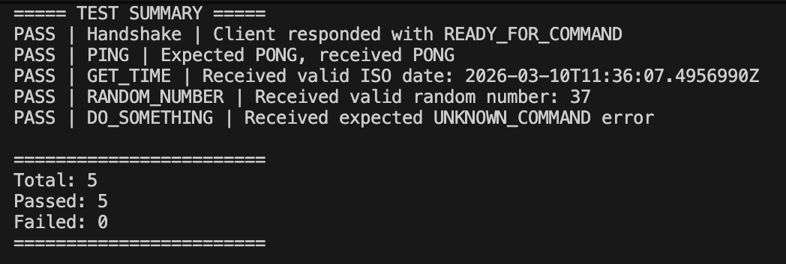

# Server–Unity TCP Communication

A lightweight TCP-based client–server communication system between a **Node.js server** and a **Unity client**, implemented as part of a Junior QA Engineer home assignment.

The project demonstrates a minimal but structured networking system including:

- TCP socket communication
- Client–server handshake
- Command-based interaction
- Structured JSON messaging protocol
- Request/response correlation
- Unit testing and end-to-end smoke testing

---

# Example End-to-End Test Run

Below is an example output from the smoke test runner validating the full communication flow between the server and the Unity client.

---

# System Architecture

The system consists of two main components communicating over TCP.

Unity Client  <---- TCP JSON Messages ---->  Node.js Server

Typical communication flow:

1. Unity client connects to the server
2. Server performs a handshake
3. Server sends a command
4. Client executes the command
5. Client returns a structured response

All communication is performed using **JSON messages transmitted over TCP sockets**.

---

# Message Protocol

Communication between the server and client follows a structured JSON protocol.

Each command message includes a **requestId** which allows the server to match responses with the original request.

Example command message:

~~~json
{
  "type": "command",
  "requestId": "req-1",
  "command": "PING"
}
~~~

Example successful response:

~~~json
{
  "type": "response",
  "requestId": "req-1",
  "command": "PING",
  "status": "success",
  "result": "PONG"
}
~~~

Example error response:

~~~json
{
  "type": "response",
  "requestId": "req-4",
  "command": "DO_SOMETHING",
  "status": "error",
  "error": "UNKNOWN_COMMAND"
}
~~~

This structure enables:

- request/response correlation
- clear error handling
- easier debugging
- protocol extensibility

---

# Server (Node.js)

The Node.js server manages the entire communication lifecycle.

Main responsibilities:

- Open a TCP socket server
- Accept incoming client connections
- Perform handshake negotiation
- Send commands to the client
- Validate incoming responses
- Handle protocol errors
- Log communication events

Key components:

`server.js`  
Main TCP server implementation handling connections and message validation.

`commandHandler.js`  
Encapsulates command logic used by the system.

`tests/`  
Contains both unit tests and end-to-end smoke tests.

---

# Unity Client

The Unity client connects to the Node.js server and executes incoming commands.

Responsibilities:

- Connect to the TCP server using `TcpClient`
- Receive JSON messages
- Parse incoming commands
- Execute the requested action
- Return structured responses to the server

The client is implemented in **C# using Unity 2018**.

---

# Supported Commands

| Command | Description |
|------|-------------|
| `PING` | Client responds with `PONG` |
| `GET_TIME` | Client returns the current UTC time |
| `RANDOM_NUMBER` | Client returns a randomly generated number |

Example interaction:

Server sends:

~~~json
{
  "type": "command",
  "requestId": "req-2",
  "command": "GET_TIME"
}
~~~

Client responds:

~~~json
{
  "type": "response",
  "requestId": "req-2",
  "command": "GET_TIME",
  "status": "success",
  "result": "2026-03-10T12:41:20.342Z"
}
~~~

---

# Project Structure

~~~text
project-root
│
├── server
│   ├── server.js
│   ├── commandHandler.js
│   ├── client.js
│   ├── package.json
│   ├── package-lock.json
│   │
│   └── tests
│       ├── commandHandler.test.js
│       └── testRunner.js
│
├── unity-client
│   ├── Assets
│   ├── Packages
│   └── ProjectSettings
│
├── docs
│   └── test-run.png
│
└── .gitignore
~~~

---

# Setup Requirements

## Node.js

Recommended version:

~~~text
Node.js 16+
~~~

Install dependencies:

~~~bash
cd server
npm install
~~~

## Unity

Requirements:

- Unity **2018**
- Unity Hub

Open the following folder as a Unity project:

~~~text
unity-client
~~~

---

# Running the Server

Start the server:

~~~bash
cd server
node server.js
~~~

The server will:

1. Listen on port **3000**
2. Wait for a Unity client connection
3. Perform handshake
4. Send a command
5. Validate the response from the client

---

# Running the Unity Client

1. Open **Unity Hub**
2. Add the `unity-client` project
3. Open it using **Unity 2018**
4. Press **Play**

The client will:

- Connect to the Node.js server
- Wait for commands
- Execute the requested command
- Return a structured response

---

# Running Tests

The server includes both **unit tests** and a **simple end-to-end smoke test runner**.

## Run Unit Tests

~~~bash
cd server
npm test
~~~

These tests validate the command handling logic.

## Run the Smoke Test Runner

~~~bash
cd server
node tests/testRunner.js
~~~

The test runner validates the full communication flow including:

- handshake communication
- `PING`
- `GET_TIME`
- `RANDOM_NUMBER`
- unknown command handling

Each step prints **PASS / FAIL** results.

---

# Design Considerations

### Structured Message Protocol

A structured JSON protocol is used for communication between server and client.

Key elements include:

- message type identification
- requestId correlation
- success/error status reporting

This approach improves:

- debugging
- protocol clarity
- system extensibility

### Separation of Command Logic

Command execution logic is encapsulated in:

`commandHandler.js`

This separation improves:

- code readability
- testability
- maintainability

### End-to-End Smoke Testing

In addition to unit tests, the project includes a lightweight smoke test runner which validates the entire communication pipeline between the server and client.

---

# Error Handling

The system includes basic handling for:

- malformed JSON messages
- unknown commands
- socket errors
- invalid protocol messages
- command timeouts

Errors are logged to the console for easier debugging.

---

# Limitations

This implementation intentionally keeps the architecture simple and does not include:

- multi-client support
- reconnection logic
- retry mechanisms
- authentication
- message queuing
- persistent logging

The goal is to demonstrate **core networking communication and testing principles** in a minimal and clear implementation.
